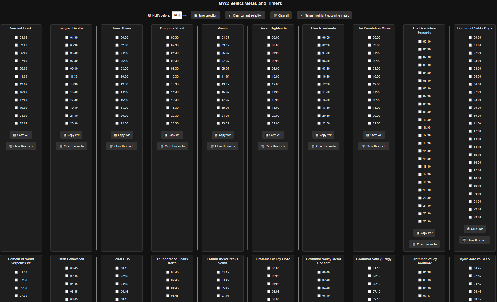
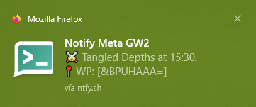

# Notificador de Metas de GW2
- Selecciona uno o varios horarios de los metas para los que se quiera notificar.
- Las notificaciones se envian a [ntfy.sh](https://ntfy.sh/). En el navegador se pueden ver en ntfy.sh/app. (Se reciben en el SO si están activadas y en dispositivo móvil con la aplicación instalada.)
- Archivo config.js con variables para personalizar. Las horas se actualizan automáticamente según la zona horaria del servidor.
- Las opciones se guardan en el archivo seleccion.json y en localStorage.

# Instalar y ejecutar
```bash
npm install
```

```bash
node server.js
```

Ir a localhost:puerto y seleccionar metas y horas.

# Imágenes de ejemplo

